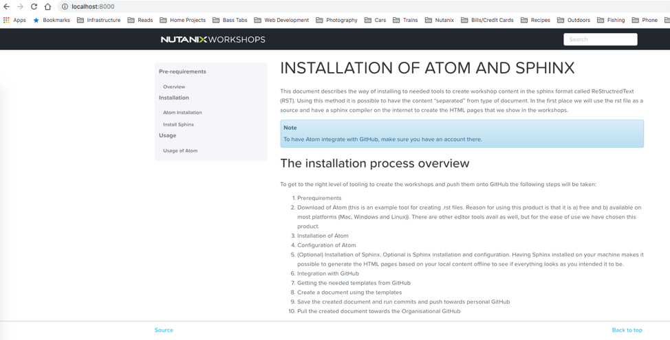

.. Adding labels to the beginning of your lab is helpful for linking to the lab from other pages
.. _authoring:

=============
Authoring and Updating Workshop Content
=============

Prior to creating or updating content, a repository must be forked and cloned to your local workstation.  If this is a new workshop, then you will need to request the Technical Enablement Team to create or modify an existing repo to add the scaffolding/templates into the repository to then be pulled and completed.  Typically, the origin GitHub repo will be NutanixWorkshops.  The following sections outline how to fork a repository, make updates, test updates, and commit those updates to then be consumed by the Technical Enablement team

Forking and cloning a repository for editing
++++++++++++++++++++++
1.	Navigate to the GitHub repository you wish to update or modify. In this example, we’re going to use “Contributing” from NutanixWorkshops: https://github.com/nutanixworkshops/contributing
2.	Click the “Fork” button in the top right to clone the repo into your GitHub account.
3.	When prompted, choose the 	account to which you wish to fork (if you only have one account, only one option will appear):

  .. figure:: images/1.png

4.	GitHub will automatically copy over the repository files and information into your individual repository.  From here, you can now Clone or Download the project to your local workstation.
  a.	Select the “Clone or Download” button from the forked project in your repository:

  .. figure:: images/2.png

  b.	If you have GitHub Desktop installed, you can select “Open in Desktop” and from there choose where you’d like to store the project files locally
  c.	Alternatively, you can use git from the command line by navigating to the directory in which you would like to save the project files locally and running

.. code-block:: bash
    cd ~/Documents/GitHub/
    git clone https://github.com/slotdawg/contributing.git
    cd contributing
    git pull

Authoring Bootcamps and making updates
++++++++++++++++++++++
Now that there is a local copy of the project on your workstation, updates can be made to the content, images, and files. For a complete reference, see the reStructuredText documentation:
`restructuredText <http://docutils.sourceforge.net/docs/user/rst/quickref.html>`-.
Images are generally saved in a directory within the project directory named ‘images’.  Reference the existing bootcamp RST or the RST documentation noted above for how to include images in the bootcamp materials.

Testing updates
++++++++++++++++++++++
Once updates have been made on the local project files, it can be tested using Sylvain Huguet (Shu’s) how tool.

1.	To use the tool, simply navigate to the root directory of the project files and create a _build directory:
.. code-block:: bash
    mkdir _build

2.	Ensure the _build directory is added to the .gitignore file in the project folder root directory. If it is not added, add it to the last line in the file:
.. code-block:: bash
    nano .gitignore
    _build
    CTRL+X

3.	Now run how in the directory to see live updates and the documentation rendered in your browser:
.. code-block:: bash
    how live

4.	Once how loads the project via the docker container, you should be able to open a browser to http://localhost:8000 to see a live rendering of the RST files and images.

5.	You can make live updates to the RST files and see the resulting changes reflected within the browser (note changes must be saved in the respective RST file before how will update it in the browser – no browser refresh is required

Publishing Updates
++++++++++++++++++++++

Commit Updates
----------------------
Once you have completed your updates and confirmed the formatting and content is correct, you can now commit the changes to your GitHub repository and then create a pull request.  To Commit changes, you can do so from the GitHub desktop:

Note that GitHub Desktop automatically detects and highlights the differences between the original version and what has been updated.  Ensure you enter a comment in the bottom left text box describing what updates have been made, then click “Commit to master.”  This will add the files and commit them to your GitHub repository.  Note that this is essentially doing the same thing as:

.. code-block:: bash
    git commit -a -m “Updated index file for demonstration purposes”
    git push

Pull Request
----------------------
Once you have committed your updates to you remote repository and are ready for the Technical Enablement team to consume your updates or contributions, you need to create a Pull Request on GitHub. Navigate to your github repository (http://www.github.com/[username])

1.	Navigate to the project you were working on and click on “New Pull Request”

2.	GitHub will automatically navigate to the original project in the NutanixWorkshops repository and list the differences between the files in the origin and the files in your repository.  Review the changes and confirm they look correct, then click “Create pull request” to send the request to the Technical Enablement Team.

  .. figure:: images/5.png
3.	The Technical Enablement Team will receive a pull request notification, then will be able to review the changes before accepting them into the master project repository
