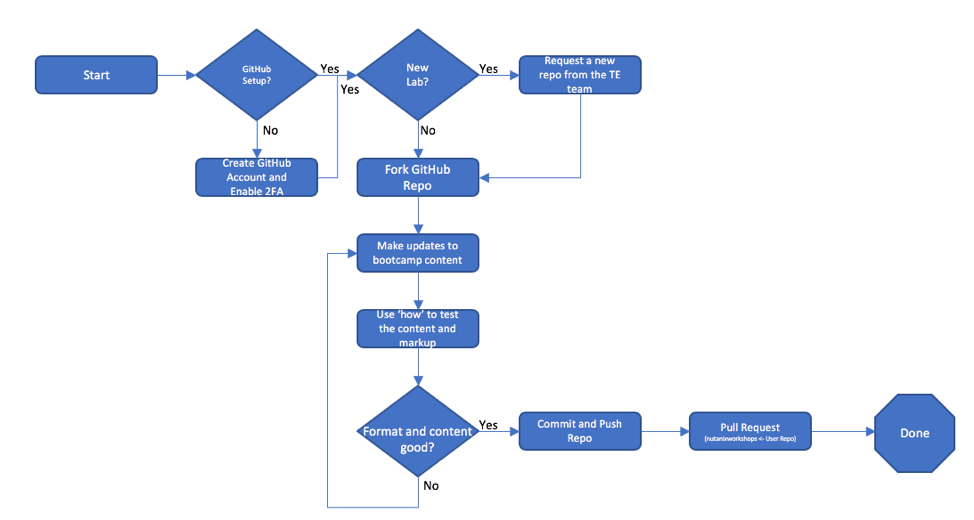

.. title:: Bootcamp Authoring and Publishing Guide

.. toctree::
  :maxdepth: 2
  :caption: Labs
  :name: _labs

  setup/setup
  authoring/authoring

.. toctree::
  :maxdepth: 2
  :caption: Appendix
  :name: _appendix
  :hidden

  appendix/glossary
  appendix/otherstuff

.. _overview:

---------------
Overview
---------------
As part of the role of Technical Marketing Engineer as well as SE Enablement, we often have to publish workshops and how-to guides for training, labs, and bootcamps.  In the past, we have typically created MS Word or Google Drive documents with the text and screenshots, which then must be converted into Sphinx markup language to then be published to the Handsonworkshops site.

This guide outlines how to pull existing workshops/bootcamps, make edits in the appropriate Sphinx markup language, view those updates, then publish the updated content so it is available to the Technical Enablement for final publishing. Below is the workflow for creating workshop content:

