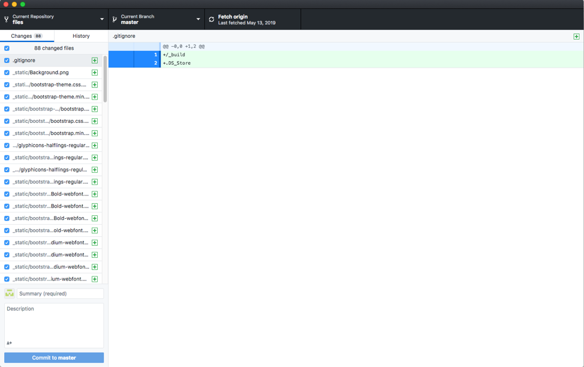

.. Adding labels to the beginning of your lab is helpful for linking to the lab from other pages
.. _setup:

=============
Setting up your Workspace
=============

Prior to creating content, a number of pre-requisites must be completed. Namely:

#.	GitHub account created and 2-Factor Authentication Enabled
#.	git is installed on the workstation
#.	[Optional] GitHub Desktop Application installed and text editor (note: if you are comfortable, you can just use the command line git binary and built-in text editors – e.g. vi, nano, etc)
#.	A directory where you would like to clone repos to

GitHub Account
++++++++++++++++++++++

Create GitHub account (2-factor authentication required). This can be accomplished relatively easily by going to github.com and signing up for free.

As per Nutanix Corporate policy, be sure to enable 2-Factor Authentication as per these guides:

- https://github.com/settings/security
- https://help.github.com/articles/securing-your-account-with-two-factor-authentication-2fa/
- https://help.github.com/articles/configuring-two-factor-authentication/

Software
+++++++++

Docker
---------
In order to use Sylvain’s how binary, Docker is required to be installed.  You can install Docker from https://docs.docker.com/install/.  Choose the binary for your platform and follow the relevant documentation to install the docker engine on your workstation.

how
---------
Sylvain Huguet wrote a Docker tool (named ‘how’) which can be used to test Sphinx RST projects locally.  Installation is relatively straightforward and is noted in the project documentation: https://github.com/shuguet/how#installation

.. code-block:: bash
    wget "https://raw.githubusercontent.com/shuguet/how/master/how" -O /usr/local/bin/how && chmod +x /usr/local/bin/how

[Optional] GitHub Desktop
---------
While not required, GitHub Desktop provides an easy-to-use desktop interface for your various projects and GitHub repositories.  It is particularly useful for tracking previous repositories and visually seeing how they compare to the origin, as over time you may forget which repos and versions you have pulled:

[Optional] Text Editor
---------
In addition to GitHub Desktop, you may wish to download a text editor for updating the Sphinx markup language.  Alternatively, you can use built-in text editors such as vi, nano, or notepad.  The benefit of using a Text Editor such as Notepad++ (Windows only) or Sublime Text is the editor will color-code the text and help with identifying syntax or formatting issues. For links to various text editors, see the Appendix
